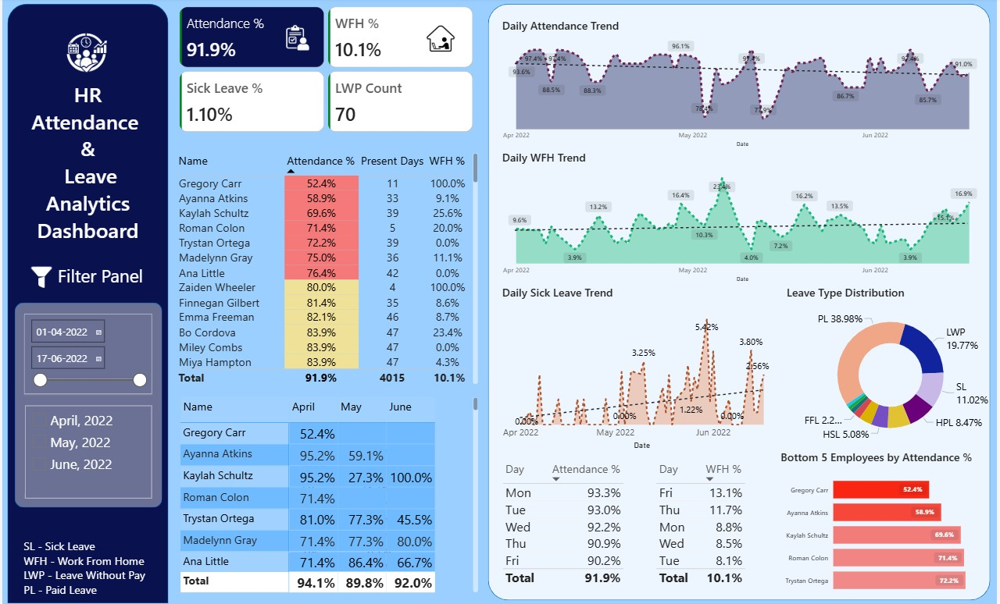

# HR-Attendance-Leave-Analytics-Dashboard-PowerBI

A Power BI dashboard for analyzing employee attendance, 
leave patterns, and work-from-home trends across multiple months for 80+ employees of a company.

## Dashboard Preview

## Project Overview
This project analyzes HR attendance data for 50+ employees, transforming raw Excel attendance 
sheets into an interactive analytics dashboard.

## Tech Stack
- **Power Query** — Data transformation & automation.
- **Power BI Desktop** — Dashboard & visualizations.
- **DAX** — Measures and calculated columns.
- **Excel** — Source data.

## Key Features
- Automated monthly data refresh using Parameters & Custom Functions in powerquery.
- Attendance %, WFH %, SL % KPI tracking.
- Employee attendance heatmap.
- Leave type breakdown. (PL, SL, WFH, LWP, BRL, ML, and more)
- Day-of-week attendance & WFH pattern analysis.
- Low-attendance employee identification.
- Monthly trend lines for Attendance, WFH and Sick Leave.
  
##  Files
| File | Description |
|------|-------------|
| `HR Attendance & Leave Analytics Dashboard.pbix` | Main Power BI file |
| `Attendance-Sheet-2022.xlsx` | Source Excel data |
| `dashboard_preview.jpg` | Dashboard screenshot |

## DAX Measures Created
- `Attendance %` — Present days / Office working days.
- `WFH %` — WFH count / Office working days.  
- `SL %` — SL count / Office working days.
- `LWP Count` — Total Leave Without Pay instances.
- `Leave Count` — Total leave days by type.
- `Present Days` — Count of P values.
- `Office Working Days` — Excluding weekends.
- `WFH Count` — WFH + HWFH combined.

##  How the Automation Works
1. Each month's data lives in a separate Excel sheet.
2. A Power Query **Parameter** stores the sheet name.
3. A **Custom Function** applies transformations to any sheet.
4. Adding a new month = one refresh click, zero manual work.

## Key Insights from Data
- Overall attendance rate: **91.9%**
- WFH adoption rate: **10.1%**
- Sick leave rate: **1.1%**
- Highest leave type: **Paid Leave (38.98%)**
- Best attendance day: **Monday (93.3%)**
- Most WFH day: **Friday (13.1%)**

## By
Shubham Kumar Bhakta
